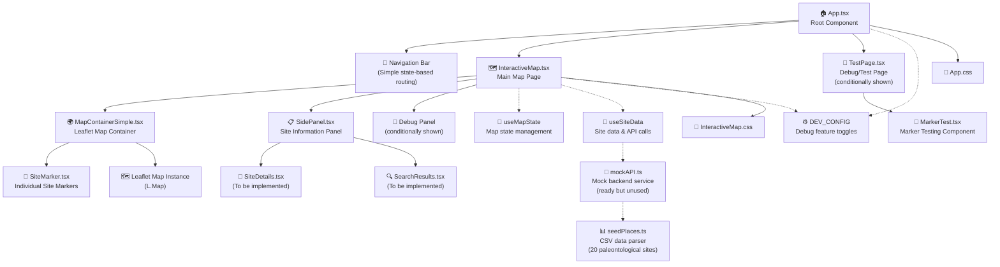

# 🏗️ PaleoLocal Frontend Component Architecture

## 📊 Component Hierarchy Diagram



## 🔄 Data Flow Architecture

### **1. Application Bootstrap**
```
App.tsx (Root)
├── State: currentPage ('main' | 'test')
├── Config: DEV_CONFIG evaluation
└── Conditional Rendering: InteractiveMap OR TestPage
```

### **2. Main Map Data Flow**
```
InteractiveMap.tsx
├── Local State Management:
│   ├── selectedSite: PaleoSite | null
│   ├── sidePanelOpen: boolean
│   └── markerRecreationCount: number
│
├── Data Sources (Current):
│   └── Hardcoded Mock Sites (3 sites):
│       ├── Grand Canyon National Park
│       ├── Petrified Forest
│       └── Fossil Butte
│
├── Event Flow:
│   ├── handleMapViewChange() → useMapState.setView()
│   ├── handleSiteClick() → setSelectedSite() + setSidePanelOpen(true)
│   └── handleMapClick() → setSidePanelOpen(false) + setSelectedSite(null)
│
└── Child Component Data Passing:
    ├── MapContainer ← {mapView, sites, selectedSiteId, handlers}
    └── SidePanel ← {isOpen, selectedSite, searchResults, handlers}
```

### **3. Map Container Data Flow**
```
MapContainerSimple.tsx
├── Props Input:
│   ├── mapView: MapViewState (center, zoom)
│   ├── sites: PaleoSite[]
│   ├── selectedSiteId: string | null
│   └── Event Handlers: onMapViewChange, onSiteClick, onMapClick
│
├── Leaflet Integration:
│   ├── mapRef: L.Map instance
│   ├── containerRef: HTMLDivElement
│   └── markersRef: Map<string, L.Marker>
│
├── Marker Management:
│   ├── Create markers for each site
│   ├── Update selected state styling
│   └── Handle click events → propagate to parent
│
└── Map Events:
    ├── moveend → onMapViewChange(center, zoom)
    ├── click → onMapClick(coordinates)
    └── marker click → onSiteClick(site)
```

### **4. Hook-Based State Management**
```
useMapState Hook
├── State: mapView {center: Coordinates, zoom: number}
├── Actions: setView(center, zoom)
└── Used by: InteractiveMap.tsx

useSiteData Hook (Currently Commented Out)
├── State: {sites, selectedSite, isLoading, error}
├── Actions: {searchSites, getSiteDetails, clearSelectedSite}
├── Integration: mockAPI.ts (ready but unused)
└── Purpose: Backend communication for site data
```

### **5. Mock API Infrastructure (Ready but Disconnected)**
```
seedPlaces.ts
├── SEED_PLACES_DATA: Raw CSV string (20 sites)
├── parseCSV(): Convert string to SeedPlace[]
├── Interface: SeedPlace {id, name, lat, lon, known_type, ...}
└── Export: PLACES_DATA array

mockAPI.ts
├── MockPaleoAPI Class:
│   ├── searchSites() → Filter by location + radius
│   ├── getSiteDetails() → Get detailed site info
│   └── generateSiteSummary() → Create AI-like summaries
│
├── Features:
│   ├── Haversine distance calculation
│   ├── Realistic API delays (500-1500ms)
│   ├── In-memory caching
│   └── DEV_CONFIG integration
│
└── Data Source: seedPlaces.PLACES_DATA
```

### **6. Configuration & Debug System**
```
DEV_CONFIG (config/dev.ts)
├── Feature Flags:
│   ├── ENABLE_DEBUG_LOGGING: false (production)
│   ├── SHOW_MARKER_TEST: false (hides test page)
│   ├── SHOW_DEBUG_PANELS: false (hides debug UI)
│   ├── USE_MOCK_API: false (enables mock backend)
│   └── MOCK_API_DELAY: 1000ms
│
├── Helper Functions:
│   ├── shouldShowDebugFeatures() → Environment detection
│   ├── isDevelopment() → Build mode check
│   └── isLocalhost() → Domain check
│
└── Usage: Conditional rendering + logging throughout app
```

## 🚧 Current State Analysis

### **✅ Working Components**
- **App.tsx**: Stable routing between main map and test page
- **InteractiveMap.tsx**: Functional with hardcoded data, marker visibility confirmed
- **MapContainerSimple.tsx**: Leaflet integration working, markers render properly
- **SiteMarker.tsx**: Custom styled markers with click handling
- **useMapState**: Map view state management functional

### **🔧 Ready Infrastructure**
- **mockAPI.ts**: Complete mock backend service with all endpoints
- **seedPlaces.ts**: CSV data parsing with 20 paleontological sites
- **useSiteData**: Hook ready for API integration
- **DEV_CONFIG**: Comprehensive debug configuration system

### **🚧 Placeholder Components**
- **SidePanel.tsx**: Basic structure, content to be implemented
- **SiteDetails.tsx**: Planned for detailed site information
- **SearchResults.tsx**: Planned for search result display

### **⏸️ Temporarily Disabled**
- **useSiteData Integration**: Commented out in InteractiveMap.tsx
- **Mock API Usage**: Infrastructure ready but not connected
- **Dynamic Site Loading**: Currently using hardcoded 3-site array

## 🎯 Integration Strategy

### **Phase 1: Mock API Testing** (Next Step)
1. Test `seedPlaces.ts` CSV parsing in isolation
2. Verify `mockAPI.ts` service functionality
3. Debug any data format issues

### **Phase 2: Gradual Hook Integration**
1. Re-enable `useSiteData` with fallback mechanism
2. Add error boundaries for API failures
3. Implement loading states

### **Phase 3: Side Panel Enhancement**
1. Implement `SiteDetails` component
2. Add search functionality
3. Enhance user interactions

### **Phase 4: Production Readiness**
1. Connect to real backend API
2. Remove mock infrastructure
3. Performance optimization

## 📝 Key Design Patterns

### **State Management**
- **Local State**: Component-specific UI state (selectedSite, sidePanelOpen)
- **Custom Hooks**: Reusable stateful logic (useMapState, useSiteData)
- **Props Down**: Data flows from parent to child components
- **Events Up**: User interactions bubble up via callback props

### **Error Handling**
- **Graceful Degradation**: Fallback to hardcoded data when APIs fail
- **Conditional Rendering**: Debug features only in development
- **Console Logging**: Configurable debug output

### **Performance Considerations**
- **useCallback**: Memoized event handlers to prevent unnecessary re-renders
- **useRef**: Direct DOM manipulation for Leaflet integration
- **Conditional Effects**: Only trigger expensive operations when necessary

## 🔗 Dependencies

### **Core Libraries**
- **React 18+**: Component framework
- **TypeScript**: Type safety
- **Leaflet 1.9+**: Map rendering
- **Vite**: Build tool and dev server

### **Custom Types**
- **PaleoSite**: Site data structure
- **Coordinates**: Latitude/longitude pairs
- **MapViewState**: Map center and zoom
- **SidePanelState**: Panel open/close state

---

*Last Updated: October 29, 2025*
*Status: Mock API infrastructure ready, markers working, gradual integration planned*