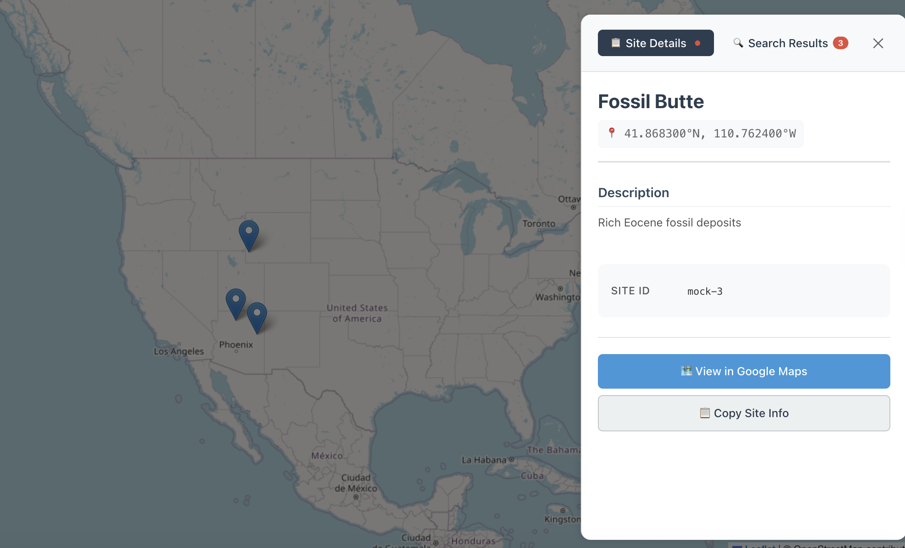

# 🏺 PaleoLocal — Paleogeology Explorer

**PaleoLocal** is a full-stack application for discovering and exploring paleogeologic sites.  
It combines an interactive React frontend with a powerful backend API using **FastAPI**, **Chroma**, **SentenceTransformers**, and **Gemini**.

## 🖼️ Application Preview



*The interactive map interface showing paleontological site details with an integrated side panel for site information, coordinates, and exploration tools.*

---

## ⚙️ Features

### 🖥️ Frontend (React + TypeScript)
- 🗺️ **Interactive Leaflet Map** with paleontological site markers
- 📋 **Dynamic Side Panel** showing detailed site information and coordinates  
- 🔍 **Tabbed Interface** for site details and search results
- 📍 **Click-to-Explore** marker interactions with smooth animations
- 📱 **Responsive Design** optimized for desktop and mobile exploration

### 🔧 Backend API (FastAPI + AI)
- 🌍 Search nearby paleogeologic or geoanthropological sites by latitude, longitude, and radius.  
- 🧠 Retrieve semantically relevant text chunks from local sources using **ChromaDB**.  
- 🔎 Embed site content locally via **SentenceTransformers**.  
- 💬 Summarize retrieved evidence with **Gemini 2,0 Flash**.  
- ⚡ FastAPI endpoints for integration with any frontend or research pipeline.  

---

## 📂 Project Structure

```
paleolocal/
├── frontend/                # React + TypeScript Interactive Frontend
│   ├── src/
│   │   ├── components/      # React components (Map, SidePanel, etc.)
│   │   ├── hooks/           # Custom React hooks (useMapState, useSiteData)
│   │   ├── services/        # API services and mock data
│   │   ├── types/           # TypeScript type definitions
│   │   └── config/          # Development and debug configuration
│   ├── package.json         # Frontend dependencies and scripts
│   └── vite.config.ts       # Vite build configuration
├── backend/                 # FastAPI + AI Backend
│   ├── app/
│   │   ├── main.py          # FastAPI entry point
│   │   ├── rag_utils.py     # Retrieval & embedding helpers
│   │   ├── prompts.py       # Prompt templates for Gemini
│   ├── scripts/
│   │   └── ingest_seed_urls.py  # Crawl + embed + store data
│   ├── chroma_db/           # Persistent Chroma vector store
├── data/
│   ├── seed_places.csv      # Seed list of sites
│   └── chunks.jsonl         # Auto-generated text chunks
├── .env                     # Gemini API key (not committed)
├── requirements.txt
└── README.md
```

---

## 🧰 Setup

### 1️⃣ Create environment
```bash
cd backend
python -m venv venv
source venv/bin/activate   # Windows: venv\Scripts\activate
pip install -r requirements.txt
```

### 2️⃣ Add environment variables
At project **root**, create a `.env` file:
```ini
GOOGLE_API_KEY=your_gemini_api_key_here
```

Optionally verify:
```bash
python -c "import os; from dotenv import load_dotenv; load_dotenv(); print(os.getenv('GOOGLE_API_KEY'))"
```

---

## 🧩 Data Ingestion

```bash
python backend/scripts/ingest_seed_urls.py
```

This script reads `data/seed_places.csv`, fetches web text, chunks it,
creates local embeddings via `SentenceTransformers`, and stores them in Chroma.

---

## �️ Run Frontend (Interactive Map)

```bash
cd frontend
npm install
npm run dev
```

Visit:
- http://localhost:3000 → Interactive map interface
- Click markers to explore paleontological sites
- Use side panel for detailed site information

---

## �🚀 Run API Server

```bash
uvicorn backend.app.main:app --reload
```

Visit:
- http://127.0.0.1:8000 → health check  
- http://127.0.0.1:8000/docs → interactive API docs

---

## 🧠 Key Endpoints

| Endpoint | Method | Description |
|-----------|--------|--------------|
| `/` | GET | Health check |
| `/api/search?lat={lat}&lon={lon}&radius_km={r}` | GET | Nearby site search |
| `/api/place/{id}` | GET | Site metadata + cached summary |
| `/api/place/{id}/generate` | POST | Generate summary with RAG + Gemini |
| `/api/place/{id}/generate?force=true` | POST | Force new generation |

---

## ⚡ RAG Flow

1. **`ingest_seed_urls.py`** → builds vector store with local embeddings  
2. **`rag_utils.py`** → retrieves relevant context from Chroma  
3. **`prompts.py`** → formats context into a Gemini prompt  
4. **Gemini 1.5 Flash** → produces concise, evidence-based summaries  
5. **`main.py`** → serves results via FastAPI endpoints  

---

## 🧪 Quick Test

```bash
curl "http://127.0.0.1:8000/api/search?lat=12.97&lon=77.59&radius_km=100"
curl -X POST "http://127.0.0.1:8000/api/place/1/generate?force=true"
```

---

## 🧾 Requirements (core)

```text
fastapi
uvicorn
chromadb>=0.5.0
sentence-transformers
beautifulsoup4
requests
tqdm
numpy
python-dotenv
google-generativeai
```

---

## 🧑‍💻 Author

**Karthik G. Shanmugasundaram**  
M.Tech (AI & DS), SRM Institute of Science and Technology  
[GitHub](https://github.com/karthikgs-in) • [LinkedIn](https://linkedin.com/in/karthikgs-in)

---

## 📜 License
MIT License © 2025 PaleoLocal Project
